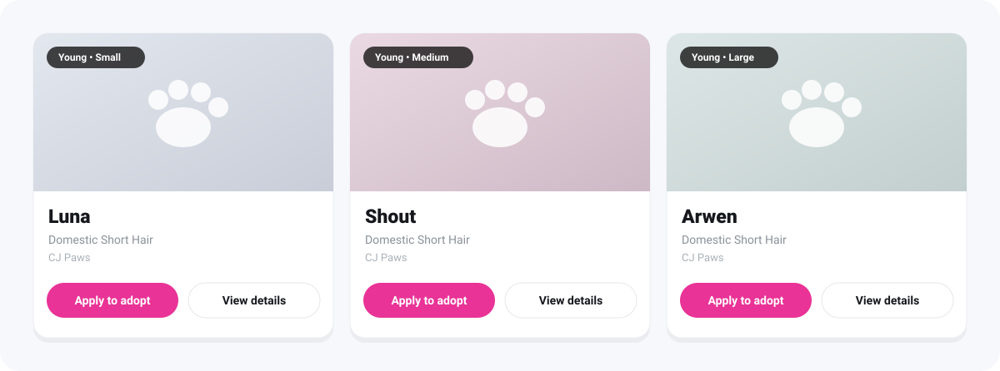

<p align="center">
  
</p>

<p align="center">
  
  
  
  
  
  
</p>

<p align="center">
  <b>A WordPress plugin that shows your shelter's adoptable Petfinder pets in a beautiful, filterable grid.</b><br>
  No API key. No cron. No stored data — listings load live in the visitor's browser.
</p>

<p align="center">
  
</p>

---

## ✨ Features

| | |
| --- | --- |
| 🐾 **Live Petfinder listings** | Real adoptable pets with photos, names, breed, size, age, and location. |
| 🔎 **Instant filtering** | Filter by breed, size, and age in the browser, with removable chips. |
| 📖 **Pet stories (flip card)** | Flip a card to read the pet's description; auto-detected with safe fallback, text stays in the DOM for SEO. |
| 🎚️ **Card display toggles** | Show/hide location, story, breed, and the age/size badge per site. |
| 💌 **Apply to adopt** | Optional button linking each pet to your application form, prefilled with its name & ID. |
| 🎨 **Fully brandable** | Your accent color, your copy, 2–4 column layouts. |
| 📱 **Responsive** | Mobile-first grid that looks great from phone to desktop. |
| ⚡ **Fast & private** | Optional shared cache; no visitor data collected; no API key to manage. |
| 🔎 **SEO & AI ready** | Emits Schema.org JSON-LD (AnimalShelter + pet ItemList) for search engines and AI crawlers. |
| ♿ **Accessible** | Labelled controls, `aria-live` updates, and reduced-motion support. |

## 🚀 Quick start

1. Copy this folder into `wp-content/plugins/purrfect-match/` — or build a ZIP
   (see [below](#-building-a-release-zip)) and upload it via **Plugins → Add New → Upload**.
2. Activate **Purrfect Match**.
3. Open **Settings → Purrfect Match** and set your Petfinder **organization ID**
   (required — e.g. `FL1629`), plus any branding/copy you like.
4. Drop the shortcode on any page or post:

```text
[purrfect_match]
```

## 🧩 Shortcode

With per-instance overrides:

```text
[purrfect_match organization="FL1629" type="cat" status="adoptable"
                limit="24" columns="3" brand="#e93396" hide_breed="false"
                title="Find your purr-fect match"]
```

| Attribute      | Default                      | Description                                              |
| -------------- | ---------------------------- | ------------------------------------------------------- |
| `organization` | *(none — required)*          | Petfinder display ID(s) or UUID(s), comma-separated.    |
| `type`         | `cat`                        | `cat`, `dog`, `rabbit`, `small-furry`, `bird`, `horse`, `barnyard`, `scales-fins-other`. |
| `status`       | `adoptable`                  | `adoptable`, `adopted`, `found`.                        |
| `limit`        | `24`                         | Max pets to load (`0` = all; up to 1000).               |
| `columns`      | `3`                          | Desktop columns (2–4).                                  |
| `hide_breed`   | `false`                      | Hide the breed name and the breed filter.              |
| `adoption_form_url` | *(empty)*               | Link each pet to your application form ("Apply to adopt"). |
| `title`        | `Find your purr-fect match`  | Main heading.                                           |
| `eyebrow`      | `Adoptable Pets`             | Small label above the heading.                          |
| `subtitle`     | `Filter by breed, size, and age.` | Subheading.                                        |
| `brand`        | `#e93396`                    | Accent color (hex).                                     |
| `org_name`     | *(empty)*                    | Shown in the banner and as a location fallback.         |
| `org_website`  | *(empty)*                    | "Visit" link in the banner.                             |

Settings also include toggles for **Show pet stories** (flip to read), **Show
location**, **Show age & size badge**, **Show plugin credit**, **SEO structured
data**, and an optional **Shared cache**. Advanced settings (`api_base`,
`s3_url`, `petfinder_url`) match the public Petfinder widget and rarely need
changing.

## ⚙️ How it works

Purrfect Match reproduces the data layer of Petfinder's own public *pet-scroller*
widget, entirely client-side:

1. Your Petfinder **organization display ID** (e.g. `FL1629`) is resolved to a
   UUID via the `GetOrganization` GraphQL query.
2. The `SearchAnimal` query returns that organization's animals (name, photo,
   breed, size, age, location, optional description, and a detail-page link).
3. Results render into the grid, and the breed / size / age filters run
   instantly in the browser against the loaded set.

Requests go directly from the visitor's browser to Petfinder's public widget
endpoint — so there's **no API key to request and no server-side request from
your site** (an optional shared cache can serve a copy from your own site to cut
repeat calls).

## 🛠 Development

This is a standard WordPress plugin with **no build step** — edit the PHP, CSS,
and JS directly. See [CONTRIBUTING.md](CONTRIBUTING.md) for details.

### 📦 Building a release ZIP

```bash
bash bin/build.sh
```

Produces `dist/purrfect-match.zip` containing only the files that ship —
developer tools, examples, and docs are excluded automatically via
`.gitattributes`.

## 📁 Project structure

```text
purrfect-match.php                 Plugin bootstrap: constants, includes, init.
includes/class-settings.php        Options, defaults, and the Settings screen.
includes/class-purrfect-match.php  Assets, shortcode, and per-instance config.
includes/class-rest.php            Optional shared-cache REST endpoint.
templates/widget.php               Front-end markup (one instance per shortcode).
assets/css/purrfect-match.css      Scoped styles (brand color + columns via CSS vars).
assets/js/purrfect-match.js        Client-side GraphQL data layer + filter UI.
uninstall.php                      Removes saved options and cache on delete.
readme.txt                         WordPress.org-style readme.
```

## 🔒 Privacy & external services

No visitor data is collected or stored. To show your pets, listing data and
photos are loaded **in the visitor's browser** from Petfinder's public widget
data source (`psl.petfinder.com/graphql`) and photo CDN. See the
[readme](readme.txt) "External services" section for the full disclosure.

> [!NOTE]
> Purrfect Match is **not affiliated with, endorsed by, or sponsored by
> Petfinder**. "Petfinder" is a trademark of its respective owner. Your use of
> Petfinder data is subject to Petfinder's terms and policies.

## 📄 License

[GPL-2.0-or-later](LICENSE). Plugin by [Andrew Mayes](https://www.andrewmayes.com/).
